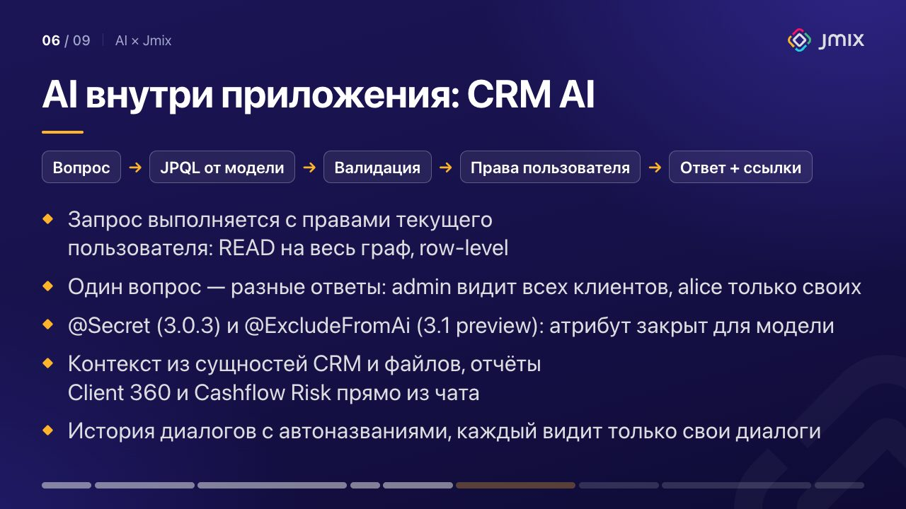
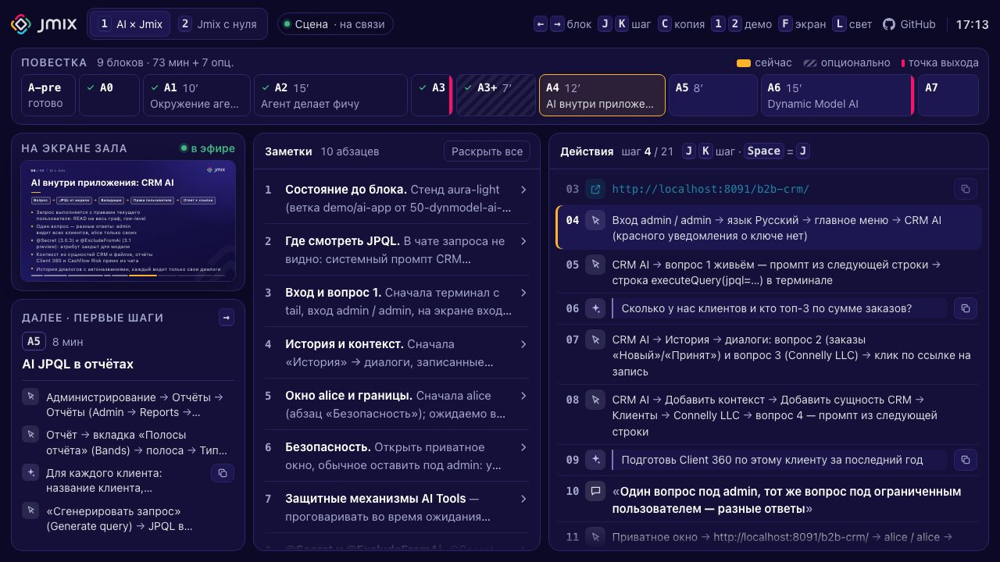

**Русский** · [English](README.en.md)

# Jmix Demo Runbook

**Открыть онлайн: [fedoseew.github.io/jmix-demo-runbook](https://fedoseew.github.io/jmix-demo-runbook/)**

[](LICENSE)
[](https://fedoseew.github.io/jmix-demo-runbook/)

Офлайн-runbook докладчика для двух живых демо [Jmix](https://www.jmix.io/). **Демо A «AI × Jmix»** (73 минуты, с опциональным блоком 80) — AI при разработке на Jmix и внутри Jmix-приложений. **Демо B «Jmix с нуля»** (45 минут, с опциональным блоком 55) — от пустого проекта до приложения из существующей базы. Одна HTML-страница показывает залу слайды на фоне Jmix, а докладчику — консоль с повесткой, таймером, заметками и пошаговыми действиями с копированием команд и промптов.

Для тех, кто был на митапе и хочет пройти демо ещё раз по шагам, повторить его на публичных репозиториях и стендах ([что доступно уже сейчас](docs/guide/ru/demos.md#что-можно-попробовать-уже-сейчас)) или сделать на этой основе свой runbook.

<p>
  
  
</p>

## Быстрый старт

Runbook управляется с клавиатуры: на телефоне видна только заставка. Что показывает каждый блок — в [Демо A и B](docs/guide/ru/demos.md).

Откройте [сайт](https://fedoseew.github.io/jmix-demo-runbook/) или работайте офлайн:

```bash
git clone https://github.com/Fedoseew/jmix-demo-runbook.git
open jmix-demo-runbook/index.html   # Windows: start, Linux: xdg-open
```

Сервер, сборка и интернет не нужны. Главные клавиши (все — по `?` и в [руководстве](docs/guide/ru/usage.md#клавиши)):

| Клавиша | Действие |
|---|---|
| `←` / `→` | предыдущий / следующий блок |
| `P` | консоль докладчика в новом окне (второй экран) |
| `N` | панель докладчика внизу сцены (проектор зеркалит экран) |
| `T` | таймер блока: старт / пауза |
| `J` / `K` | следующий / предыдущий шаг в консоли или панели |

### Подготовка к демо

Стенд, базу и pre-flight поднимает скрипт `./demo` (bash, macOS и Linux; проекты — в `~/IdeaProjects`):

```bash
./demo setup     # один раз: worktree jmix-crm-stand на demo/ai-app, jar ~/demo-jars/crm.jar, клон crm-from-db, Playwright
./demo up a      # стенд aura-light на :8091 (демо A и тизер B4); ./demo up b — ещё PostgreSQL на :5434
./demo prepare   # накануне, после ./demo reset: диалоги A4 и скриншоты-fallback в assets/
./demo check     # pre-flight: таблица PASS / WARN / FAIL
./demo reset b   # после репетиции демо B: база crm-from-db из дампа
./demo down      # остановить стенд и базу
```

Или из IntelliJ IDEA: проект `~/IdeaProjects/jmix-crm-stand`, run-конфигурация «Stand aura-light (OpenAI)» вместо `./demo up a`; проект `crm-from-db`, «crm-from-db database» и «crm-from-db app». Нужны JDK 21, Docker (демо B) и ключ `SPRING_AI_OPENAI_APIKEY` в окружении. Все команды — `./demo help` и [Демо A и B → Что подготовить](docs/guide/ru/demos.md#что-подготовить).

## Документация

| Руководство | О чём |
|---|---|
| [Как вести демо](docs/guide/ru/usage.md) | второй экран или зеркало, все клавиши, таймер, шаги и короткая версия, pre-flight, если что-то не так |
| [Демо A и B](docs/guide/ru/demos.md) | аудитория, цели, тайминг с опциональными блоками и точками выхода, что показывает каждый блок, что подготовить |
| [Как править контент](docs/guide/ru/content.md) | схема `content.js`, поля блока, конвенции, тесты, свой runbook и публикация на GitHub Pages |
| [Архитектура](docs/guide/ru/architecture.md) | файлы, модель состояния, синхронизация двух окон, тесты, инструменты для скриншотов и смоука |

Также: [открытые вопросы к репетиции](docs/open-questions.md) · [spec](docs/superpowers/specs/2026-10-07-jmix-demo-runbook-design.md) · [ревью 2026-10-08](docs/review-2026-10-08.md) · [инструкции для AI-агентов](AGENTS.md)

## Структура репозитория

```text
jmix-demo-runbook/
├── index.html              разметка, CSS, SVG-спрайт (логотип, иконки, QR), meta и Open Graph
├── content.js              контент обоих демо: слайды, заметки, шаги (globalThis.DEMOS)
├── core.js                 чистая логика без DOM: состояние, таймер, шаги (globalThis.Runbook)
├── app.js                  DOM: сцена, консоль, панель зеркала, клавиши, синхронизация окон
├── demo                    подготовка демо: стенд, база, pre-flight (./demo help)
├── test/                   node --test: контент, логика, разметка, загрузка страницы
├── tools/                  shot.mjs — скриншоты, smoke.mjs — смоук двух окон, capture-fallbacks.mjs — скриншоты-fallback со стенда, browser.mjs — общий запуск Playwright
├── assets/README.md        какие скриншоты-fallback нужны и как их снять (сами PNG в .gitignore)
├── docs/
│   ├── guide/ru, guide/en  руководства
│   ├── images/             скриншоты для README, руководств и превью ссылки
│   ├── open-questions.md   что проверить на репетиции
│   ├── review-2026-10-08.md  независимое ревью
│   └── superpowers/        spec и планы реализации (история)
├── AGENTS.md               инструкции для AI-агентов; CLAUDE.md ссылается на него
├── .agents/skills/         skills для агентов (в .claude/skills — ссылки на них)
├── .nojekyll               GitHub Pages отдаёт файлы как есть
└── LICENSE                 Apache License 2.0
```

## Полезные ссылки

| Группа | Ссылка | Что это |
|---|---|---|
| Runbook | [fedoseew.github.io/jmix-demo-runbook](https://fedoseew.github.io/jmix-demo-runbook/) | этот runbook онлайн |
| | [Fedoseew/jmix-demo-runbook](https://github.com/Fedoseew/jmix-demo-runbook) | исходники, issues |
| Репозитории демо | [jmix-agent-toolkit](https://github.com/jmix-framework/jmix-agent-toolkit) | skills, guidelines и инструменты для AI-агентов (A1, A2, B4) |
| | [jmix-cli](https://github.com/jmix-framework/jmix-cli) | создание проектов из терминала: мастер и `--non-interactive` (A3, B1) |
| | [jmix-crm](https://github.com/jmix-framework/jmix-crm) | B2B CRM с AI-функциями; ветка `main` — основа задачи агента (A2) |
| | [jmix-crm, ветка demo/agent-task](https://github.com/jmix-framework/jmix-crm/tree/demo/agent-task) | промпт `demo/PROMPT.md` и результат задачи агента одним коммитом (A2) |
| | [jmix-crm, ветка demo/ai-app](https://github.com/jmix-framework/jmix-crm/tree/demo/ai-app) | стенд демо A4–A6: CRM AI, отчёты с AI JPQL, Dynamic Model AI; сборка — в `demo/dynmodel-ai-agent/README.md` |
| | [jmix-crm, ветка 50-dynmodel-ai-agent](https://github.com/jmix-framework/jmix-crm/tree/50-dynmodel-ai-agent) | стенд Dynamic Model AI, основа `demo/ai-app` (A6) |
| | [crm-from-db](https://github.com/Fedoseew/crm-from-db) | проект демо B: PostgreSQL с дампом CRM и ветки `b/01-empty` … `b/05-agent` (B1–B4) |
| | [demo.jmix.io/b2b-crm](https://demo.jmix.io/b2b-crm/login) | та же CRM онлайн |
| Документация | [docs.jmix.io](https://docs.jmix.io/jmix/) · [Tutorial](https://docs.jmix.io/jmix/tutorial/index.html) | документация Jmix и пошаговый туториал — с чего начать |
| | [AI Tools](https://docs.jmix.io/jmix/ai-tools/index.html) · [начало работы](https://docs.jmix.io/jmix/ai-tools/getting-started.html) | add-on AI Tools: LLM-ассистент в приложении отвечает на вопросы по данным (CRM AI, A4) |
| | [Jmix AI в Studio](https://docs.jmix.io/jmix/studio/ai-assistant.html) · [Coding assistance](https://docs.jmix.io/jmix/studio/coding-assistance.html) | чат по документации (A3) и Ask AI about code (A3+); инспекции и quick-fix'ы Studio, которые ловят ошибки агента (A2) |
| | [Dynamic Model](https://docs.jmix.io/jmix/dyn-model/index.html) | новые сущности и атрибуты в работающем приложении без кода и перезапуска (A6) |
| | [Отчёты](https://docs.jmix.io/jmix/reports/index.html) | add-on Reports: отчёты по шаблонам; AI-generated JPQL — в 3.1 preview (A5) |
| | [Reverse engineering](https://docs.jmix.io/jmix/studio/reverse-engineering.html) · [Data stores](https://docs.jmix.io/jmix/studio/data-stores.html) | модель из существующей БД и хранилища данных (B2) |
| | [Security](https://docs.jmix.io/jmix/security/index.html) | роли, row-level политики (A4, B3) |
| Сообщество | [forum.jmix.io](https://forum.jmix.io/) | форум: вопросы и ответы |
| | [Jmix Studio](https://plugins.jetbrains.com/plugin/14340-jmix) | плагин IntelliJ IDEA |

<details>
<summary>Ещё ссылки: исходники, AI, примеры, миграция, сообщество</summary>

| Группа | Ссылка | Что это |
|---|---|---|
| Исходники | [jmix-framework/jmix](https://github.com/jmix-framework/jmix) | исходники фреймворка Jmix |
| | [jmix-docs](https://github.com/jmix-framework/jmix-docs) | исходники документации Jmix 3+ |
| | [What's new](https://docs.jmix.io/jmix/whats-new/index.html) | что нового в версиях |
| AI | [jmix-mcp-docs](https://github.com/jmix-framework/jmix-mcp-docs) | удалённый MCP-сервер для поиска по документации и примерам Jmix |
| | [ai-assistant.jmix.io](https://ai-assistant.jmix.io/) | Jmix AI в браузере |
| | [jmix-ai-backend](https://github.com/jmix-framework/jmix-ai-backend) | бэкенд Jmix AI |
| Примеры | [jmix-ui-samples](https://github.com/jmix-framework/jmix-ui-samples) · [онлайн](https://demo.jmix.io/ui-samples/) | примеры UI-компонентов |
| | [jmix-samples-2](https://github.com/jmix-framework/jmix-samples-2) | решения типовых задач |
| | [jmix-bookstore](https://github.com/jmix-framework/jmix-bookstore) | приложение книжного магазина |
| | [jmix-petclinic](https://github.com/jmix-framework/jmix-petclinic) | Petclinic на Jmix |
| | [jmix-onboarding](https://github.com/jmix-framework/jmix-onboarding) | приложение из Tutorial |
| | [jmix-windturbines](https://github.com/jmix-framework/jmix-windturbines) | mobile-first приложение для обслуживания ветрогенераторов |
| | [jmix-commercial-addons-demo](https://github.com/jmix-framework/jmix-commercial-addons-demo) | демо коммерческих add-ons |
| | [demo.jmix.io](https://demo.jmix.io/) | все онлайн-демо |
| Миграция и инструменты | [jmix-migration-from-v1](https://github.com/jmix-framework/jmix-migration-from-v1) | шаблон AI-миграции с Jmix 1.x на 2.x |
| | [jmix-migration-from-cuba-platform](https://github.com/jmix-framework/jmix-migration-from-cuba-platform) | шаблон AI-миграции с CUBA Platform 7.2 на Jmix 2.x |
| | [jmix-masquerade](https://github.com/jmix-framework/jmix-masquerade) | библиотека UI-тестов |
| | [jmix-dependencies-tool](https://github.com/jmix-framework/jmix-dependencies-tool) | зависимости Jmix для изолированных сред без интернета |
| Сообщество | [jmix.io](https://www.jmix.io/) | сайт Jmix |
| | [Marketplace](https://www.jmix.io/marketplace/) | add-ons |
| | [Обучение](https://www.jmix.io/training/) | курсы для команд |
| | [YouTube](https://www.youtube.com/channel/UCEmWc8OwhgHnAV7vVVxtglQ) | видео и вебинары |
| | [github.com/jmix-framework](https://github.com/jmix-framework) · [github.com/jmix-projects](https://github.com/jmix-projects) | все репозитории; в jmix-projects — старые примеры и демо |

</details>

## Лицензия и участие

Код и тексты — под [Apache License 2.0](LICENSE). Берите runbook за основу своего демо: fork, свой `content.js`, свои цвета и QR — пошагово в [«Как править контент»](docs/guide/ru/content.md#свой-runbook-на-основе-этого). Нашли ошибку или есть идея — [issue](https://github.com/Fedoseew/jmix-demo-runbook/issues) или pull request; перед PR прогоните `node --test`, коммиты — в стиле conventional commits.
