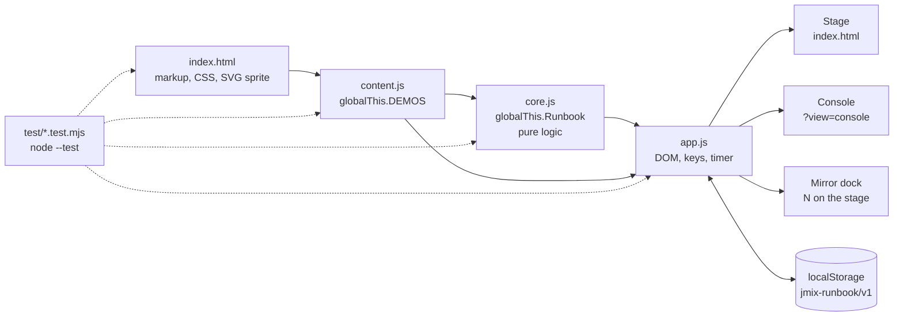
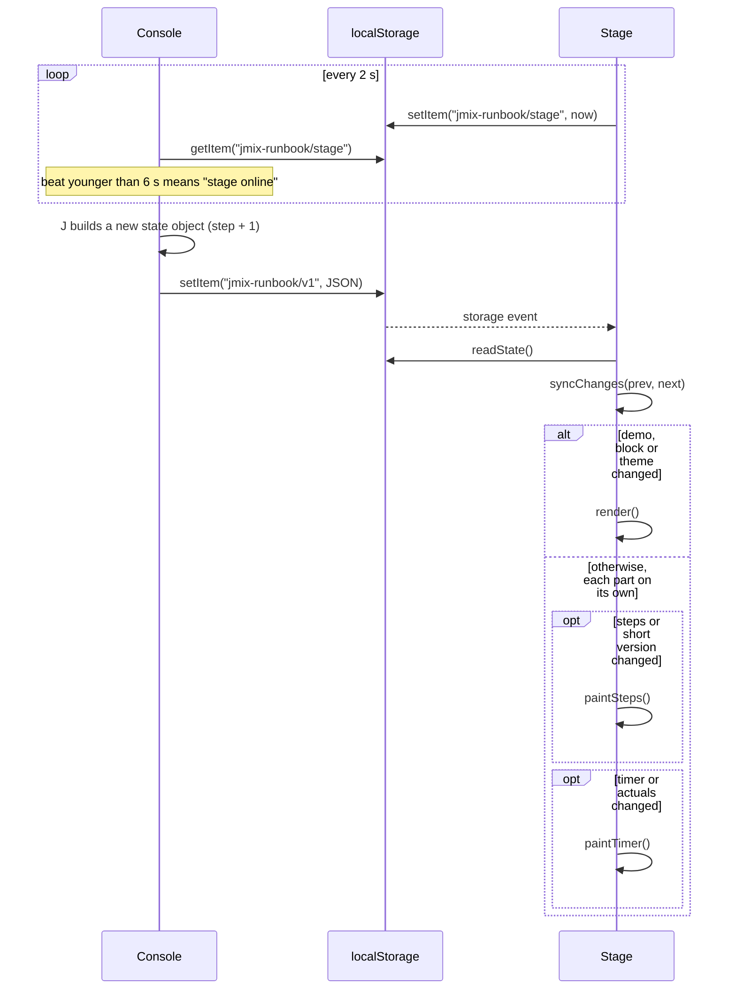

[Русский](../ru/architecture.md) · **English** · [← README](../../../README.en.md)

# Architecture

A static page with no build step and no dependencies: three scripts and `index.html`. It works the same from disk (`file://`) and from GitHub Pages, and makes no external requests.

- [Files](#files)
- [State](#state)
- [Two-window sync](#two-window-sync)
- [Views](#views)
- [Timer](#timer)
- [Constraints](#constraints)
- [Tests](#tests)
- [Tools](#tools)

## Files

| File | Responsible for |
|---|---|
| `index.html` | markup, all CSS (palette tokens in `:root`), the SVG sprite (logo, step icons, repository QR), the `?` reference (`<dialog id="keys">`), meta and Open Graph tags. Loads `content.js`, `core.js`, `app.js` in that order by relative paths |
| `content.js` | the data for both demos, `globalThis.DEMOS` ([schema](content.md#the-demos-schema)) |
| `core.js` | pure logic without the DOM, `globalThis.Runbook`: loading and validating state, the timer and block changes, pace, step classification, note leads, typography, `flowOf`. Tested in Node |
| `app.js` | the DOM: stage, console, mirror dock, keys, copying, the on-screen timer, window sync |
| `test/` | `node --test`: `content`, `core`, `html`, `app`, plus the `load.mjs` loader |
| `tools/` | `shot.mjs` (screenshot), `smoke.mjs` (two-window smoke test), `browser.mjs` (Chromium launcher for both) |
| `.agents/skills/` | agent skills; `.claude/skills/` holds relative symlinks to them. On Windows, enable symlinks before cloning (`git config --global core.symlinks true` with Developer Mode on) or copy `.agents/skills/*` into `.claude/skills/` |



If `content.js` or `core.js` fails to load (a typo after an edit, an old browser), `app.js` shows the reason instead of a blank screen. `core.js` uses no regex lookbehind: Safari before 16.4 would reject the whole file.

## State

**Shared between windows**: one object in `localStorage` under the `jmix-runbook/v1` key.

| Field | Holds |
|---|---|
| `demo` | `'a'` or `'b'` |
| `index` | the current block's position in the demo |
| `indexByDemo` | the position in each demo, so an accidental `2` → `1` from either window returns to the same block |
| `timer` | `{ running, startedAt, elapsedBefore }` for the current block |
| `elapsed` | actual time per block in seconds: `{ A4: 754, … }` |
| `steps` | the current step of each block: `{ A4: 3, … }` |
| `short` | short version on |
| `light` | light stage |

`Runbook.loadState` checks the type of every field, drops unknown ones, and reads state saved by older versions (without `indexByDemo`). State is never mutated: each change builds a new object and writes it whole (`saveState`). Storage access is wrapped in `try/catch`.

**Per window:**

- the view comes from the URL (`?view=console` or the stage) and is never stored;
- whether the mirror dock is open is kept in `sessionStorage` under `jmix-runbook/dock`, so it survives F5 in that tab only;
- pre-flight checklist ticks live in the window's memory until F5.

**Heartbeat.** The stage window writes the time to `jmix-runbook/stage` every 2 s. The console treats the stage as open while the beat is younger than 6 s, and shows «Сцена · на связи» (stage online) or «Сцена не найдена» (stage not found).

## Two-window sync

The windows never talk to each other directly: on `file://` the page has an opaque origin and `window.opener` is blocked. They communicate through `localStorage` and the `storage` event, which the browser delivers to every other window of the same origin.



`Runbook.syncChanges` decides what to repaint. A full render happens only when the demo, block or theme changes; otherwise steps and the timer are painted in place, each one if it changed, so notes expanded in the console stay expanded.

## Views

| View | How to open | Contents |
|---|---|---|
| Stage | `index.html` | a 16:9 slide in a `container-type: inline-size` box: counter, title, yellow rule, `flow` strip, bullets, progress strip. For pre-flight, a holding slide with the agenda and the QR code. `fitStage` shrinks bullets from `2.5cqw` down to `2.19cqw` |
| Console | `P` on the stage, or `index.html?view=console` | agenda, timer and pace, stage thumbnail, the next card, notes with leads, steps, GitHub link |
| Mirror dock | `N` on the stage | block time, current and next step, key legend; `sizeDock` sets its height from the block's longest step |
| Key reference | `?` in any view | `<dialog id="keys">` with every key |

Markup is built with template strings; all content text goes through `Runbook.esc` (escaping) or `Runbook.typo` (escaping plus stage typography).

## Timer

- Block time: `elapsedNow = elapsedBefore + (now − startedAt)` while running. `startedAt` is an absolute time, so F5 or a closed tab doesn't lose time.
- `Runbook.leaveBlock` on a block change: the time of the block you leave goes into `elapsed` (if it is at least `SKIP_SEC`, 30 s), a running timer continues on the new block from that block's actual, a move onto pre-flight stops it, and going from pre-flight to the first block of the same demo starts it (`running = !to.pre && (timer.running || startsTalk)`).
- `Runbook.pace` computes plan, actual and the gap over blocks with an actual plus the current block.

## Constraints

- Zero external requests: no CDN, no web fonts, no `fetch`. System fonts only. Meta and Open Graph tags are not requests.
- Works from `file://`.
- Jmix palette: `#17124B`, `#FDB42B`, `#FC1264`, `#41B883`, text `#DBDDE1`. Text contrast of at least 4.5:1 on console and light-dock backgrounds.
- Text size floors: stage bullets at least 28px at 1280 wide; the console (presenter only) at least 14px; the mirror dock and the key reference (the audience sees them) at least 18px.
- Keys are read by `event.code`, so they work in any layout.
- `localStorage`, `sessionStorage`, the clipboard, fullscreen and `window.open` are wrapped in `try/catch` or have their result checked.
- No `console.log` in page code.

## Tests

```bash
node --test
```

- `test/load.mjs` runs project files in `node:vm` with stub globals, so `content.js` and `core.js` are tested without a browser.
- `core.test.mjs`: logic (state, timer, steps, pace, sync, typography, `flowOf`).
- `content.test.mjs`: content rules (see [content.md](content.md#checking-your-changes)).
- `html.test.mjs`: markup and CSS (external resources, script order, contrast, font sizes, the key reference).
- `app.test.mjs`: `app.js` without `content.js` or `core.js` reports the reason instead of crashing.

The tools below check behaviour in a real browser.

## Tools

Both tools find Playwright this way: the `PLAYWRIGHT_MODULE` variable (a module path or package name), else the `playwright` package, else `playwright-core`. The browser comes from `CHROME_PATH` if set, otherwise the one Playwright installed. Without a global install:

```bash
npm i --no-save playwright && npx playwright install chromium
```

**`tools/shot.mjs`** takes a screenshot in a given state:

```bash
node tools/shot.mjs <url|path> <out.png|out.jpg> [stateJSON|-] [width] [height] [keys]
node tools/shot.mjs index.html /tmp/a6-dock.png '{"demo":"a","index":8}' 1280 720 KeyN,KeyJ
```

`stateJSON` goes into `localStorage['jmix-runbook/v1']` before a reload; keys are comma-separated `KeyboardEvent.code` values. JPEG (quality 82) or PNG by extension. A console shot (`?view=console`) gets a fresh stage heartbeat, so it shows the stage as online. It prints page errors and external requests and exits with code 1 if there are any. `SHOT_DELAY_MS` (default 400) is the pause before the shot; 3000 waits for the stage key hint to fade.

**`tools/smoke.mjs`** is a two-window smoke test: stage, `P` opens the console, jump to A4, `T`, `J` ×3, the stage dock shows the same step, and after reloading both windows the block, step and running timer are still there, with no errors or external requests. It prints `PASS` / `FAIL` lines and exits with code 1 on any failure.

```bash
node tools/smoke.mjs            # index.html next to tools/
node tools/smoke.mjs https://fedoseew.github.io/jmix-demo-runbook/
```

---

Next: [running a demo](usage.md) · [demos A and B](demos.md) · [editing the content](content.md)
