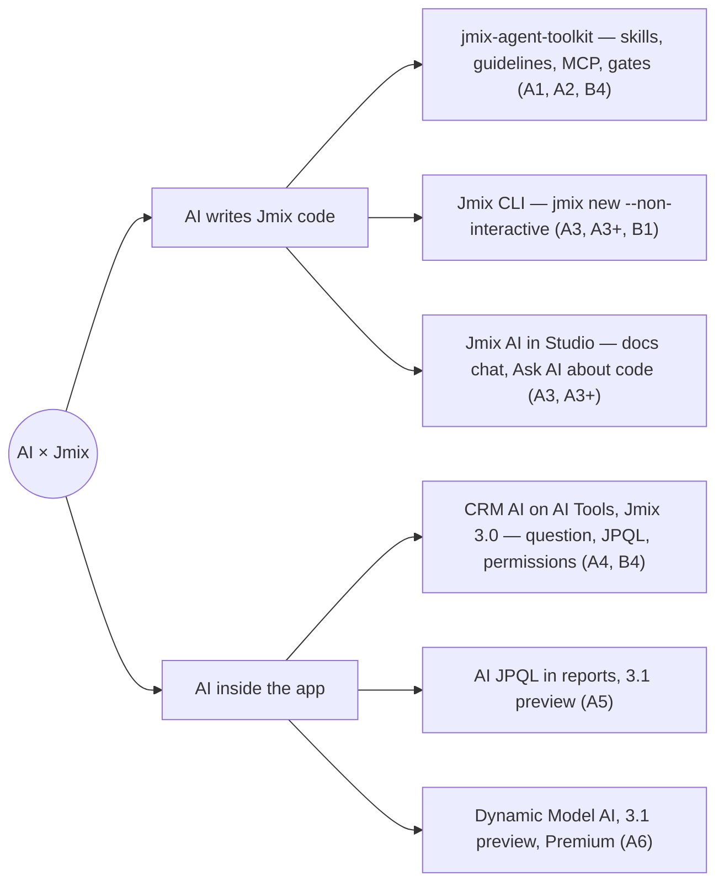
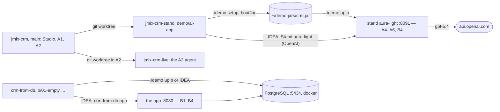

[Русский](../ru/demos.md) · **English** · [← README](../../../README.en.md)

# Demos A and B

Two live Jmix demos for two audiences. The rule is as little live code generation on stage as possible: every step is prepared in a branch or on a stand ahead of time, and every AI step has a fallback. The full plan and its reasoning are in the [spec](../../superpowers/specs/2026-10-07-jmix-demo-runbook-design.md) (§3–4, §6–7, in Russian). The demos are delivered in Russian; block titles below are translated.

- [The AI × Jmix map](#the-ai--jmix-map)
- [Demo A: AI × Jmix](#demo-a-ai--jmix)
- [Demo B: Jmix from scratch](#demo-b-jmix-from-scratch)
- [What to prepare](#what-to-prepare)
- [What you can try today](#what-you-can-try-today)

## The AI × Jmix map

Demo A follows two axes: AI that helps you write Jmix code, and AI that runs inside a Jmix application. The blocks where each tool appears are in brackets.



## Demo A: AI × Jmix

**Audience:** developers with about a year of Jmix experience. **Length:** 73 minutes core, 80 with the optional A3+; Q&A is part of A7.

**Goals:** show how an AI agent writes Jmix code and why Jmix suits it (Spring Boot, metadata and XSD catch errors before the app runs, security by default, UI in plain Java); show AI inside the app (answers over data that respect permissions, AI queries in reports, changing the data model in plain words); be honest about the limits.

```mermaid
gantt
  title Demo A "AI × Jmix" — 73 min core, 80 with the optional block
  dateFormat HH:mm
  axisFormat %H:%M
  section Developing with AI
  A0 The AI × Jmix map              :a0, 00:00, 5m
  A1 The agent's environment        :a1, after a0, 10m
  A2 The agent builds a feature     :a2, after a1, 15m
  A3 Jmix CLI and Jmix AI           :a3, after a2, 3m
  Exit point 1 — skip A3+           :milestone, x1, after a3, 0m
  A3+ CLI wizard, Ask AI (optional) :active, a3p, after a3, 7m
  section AI inside the app
  A4 CRM AI                         :a4, after a3p, 12m
  A5 AI JPQL in reports             :a5, after a4, 8m
  A6 Dynamic Model AI               :a6, after a5, 15m
  Exit point 2 — A6 in 8 min        :milestone, x2, after a5, 0m
  section Wrap-up
  A7 Summary and Q&A                :a7, after a6, 5m
```



The light bar is the optional block; diamonds are exit points.

| # | Block | Min | What it shows |
|---|---|---|---|
| A-pre | Pre-flight | — | Setup checklist; the audience sees a holding slide with the agenda and a QR code for the repository |
| A0 | The AI × Jmix map | 5 | The two axes, why Jmix suits an agent, the Haulmont «Jmix vs Spring» benchmark, and the honest part: agents invent APIs, caught by inspections, tests and review |
| A1 | The agent's environment: jmix-agent-toolkit | 10 | Installing the toolkit (Studio 3.0+ or `install.sh`) and what it adds to the project: skills, guidelines, MCP, Playwright; the `jmix` hub skill and the gates |
| A2 | The agent builds a feature | 15 | "Contract: entity, list, detail, role, test" on jmix-crm: 3 minutes live, then the finished result from the `demo/agent-task` branch; where the framework catches mistakes |
| A3 | Jmix CLI and Jmix AI | 3 | `jmix --no-update new … --non-interactive`, the new project already has `.skills`; one Jmix AI question. **Exit point 1:** if behind, go straight to A4 |
| A3+ | CLI wizard and Ask AI about code | 7, optional | The `jmix --no-update` wizard up to Location and setup, then exit; the "CLI command:" line from the rehearsal screenshot; Ask AI about code on selected code |
| A4 | AI inside the app: CRM AI | 12 | Question → JPQL → validation → answer with record links; the same question as admin and as alice gives different answers; `@Secret`, `@ExcludeFromAi`; Client 360 from the chat |
| A5 | AI JPQL in reports | 8 | A new report dataset type: prompt → "Generate query" → JPQL you can see and edit; runs without a model, with the user's permissions |
| A6 | Dynamic Model AI | 15 | Describe in words → plan → "Confirm plan" → "Apply" → screens in the menu at once; the agent's limits. **Exit point 2:** an 8-minute short version, the `[8]` steps |
| A7 | Summary and Q&A | 5 | What ships today (3.0) and what is in 3.1 preview, how to start tomorrow, where the demo materials are |

## Demo B: Jmix from scratch

**Audience:** developers new to Jmix. **Length:** 45 minutes core, 55 with the optional B4; at its exit point B4 takes 3 minutes, 48 in total.

**Goals:** explain what Jmix is and where it fits, create a project two ways (Studio and CLI), get a working app from an existing database in 15 minutes, extend it by hand, and show the bridge to AI.

```mermaid
gantt
  title Demo B "Jmix from scratch" — 45 min core, 55 with the optional block
  dateFormat HH:mm
  axisFormat %H:%M
  section Introduction
  B0 What Jmix is                     :b0, 00:00, 8m
  B1 A project two ways               :b1, after b0, 7m
  section The app
  B2 An app from an existing database :b2, after b1, 15m
  B3 Hand edits in Studio             :b3, after b2, 10m
  section Bridge to AI
  Exit point — only 3 min of CRM AI   :milestone, x1, after b3, 0m
  B4 Bridge to AI (optional)          :active, b4, after b3, 10m
  section Wrap-up
  B5 Summary                          :b5, after b4, 5m
```



| # | Block | Min | What it shows |
|---|---|---|---|
| B-pre | Pre-flight | — | Setup checklist; the audience sees a holding slide with the agenda and a QR code for the repository |
| B0 | What Jmix is | 8 | Spring Boot + Vaadin Flow + JPA, Studio and add-ons; where Jmix fits and where it doesn't; licensing |
| B1 | A project two ways: Studio and CLI | 7 | Studio New Project and the `jmix --no-update` wizard share templates; `--non-interactive` for scripts and agents; project layout, run, log in |
| B2 | An app from an existing database | 15 | PostgreSQL with the CRM schema → Generate Model from Database → entities with relations → list and detail views → run with real data: sorting, the filter and fields picked by attribute type with no UI code; Liquibase leaves existing tables alone |
| B3 | Hand edits in Studio | 10 | A `rating` attribute added live, Studio writes a one-column changelog; the ready role "Manager: Clients read-only" from `b/04-role`, assigned, then log in as the manager |
| B4 | Bridge to AI | 10, optional | The toolkit in the same project, one prompt "list view for Invoice" → result from the `b/05-agent` branch; a CRM AI teaser. **Exit point:** if behind, only 3 minutes of CRM AI |
| B5 | Summary | 5 | A recap strip from the existing database to the manager role; docs, Studio trial, online demo, forum, a step for tomorrow, where the demo materials are |

## What to prepare

The runbook refers to branches, stands and ports by the names in spec §6–7. The demo branches and the demo B repository are ready and on GitHub; how to repeat the demos with them is in [What you can try today](#what-you-can-try-today).

**Repositories and branches**

| What | Based on | Used for |
|---|---|---|
| [`jmix-crm`](https://github.com/jmix-framework/jmix-crm), branch [`demo/ai-app`](https://github.com/jmix-framework/jmix-crm/tree/demo/ai-app) | [`50-dynmodel-ai-agent`](https://github.com/jmix-framework/jmix-crm/tree/50-dynmodel-ai-agent) | the `aura-light` stand, `demo/dynmodel-ai-agent/stands.sh` and the run configuration «Stand aura-light (OpenAI)», A4–A6 demo data, `@ExcludeFromAi` on `Contact.phone` and `Contact.email`, JPQL in the log (DEBUG), the report archive `demo/reports/ai-jpql-reports.zip` (the stand imports it itself) |
| `jmix-crm`, branch [`demo/agent-task`](https://github.com/jmix-framework/jmix-crm/tree/demo/agent-task) | `main` | the A2 prompt in `demo/PROMPT.md` and the agent's result as one commit with the gate evidence |
| [`crm-from-db`](https://github.com/Fedoseew/crm-from-db) | `jmix new`, Jmix 3.0.3 | `db/docker-compose.yml` (PostgreSQL 17.11 on port 5434) and `db/crm.sql` (CRM schema and data dump), branches `b/01-empty` → `b/02-model` → `b/03-views` → `b/04-role` → `b/05-agent`, IDEA run configurations in `.run/` |

**Infrastructure: `./demo`**

The script `./demo` in the runbook root (bash, macOS and Linux) brings up the stand, the database and the pre-flight. The projects live in `~/IdeaProjects`: `jmix-crm` stays on `main` all the time (Studio, A1 and A2), the stand lives in a separate worktree `jmix-crm-stand` on the `demo/ai-app` branch, demo B in `crm-from-db`. `./demo` without a command opens a menu: the actions are grouped by demo, each next to the command it runs; Ctrl+C stops the command and comes back to the menu.



| Command | What it does | When |
|---|---|---|
| `./demo setup` | the `jmix-crm-stand` worktree (if missing), `./gradlew bootJar` in it, an atomic copy of the jar to `~/demo-jars/crm.jar`, a clone of `crm-from-db` (if missing) and a clean clone moved to `b/01-empty`, Playwright with Chromium for `prepare` (if it does not start); refuses while the stand runs | once, and after `demo/ai-app` changes |
| `./demo up a`, `./demo up b` | the `aura-light` stand on `:8091`, waits for HTTP 302 (up to 120 s); `b` also starts PostgreSQL on `:5434` and waits for the CRM tables. A stand already started from IDEA is detected and not started twice | before the rehearsal and on the demo day |
| `./demo prepare` | `tools/capture-fallbacks.mjs a4 b4 a5`: CRM AI warm-up, the A4 dialogs as admin and alice, the B4 teaser, the A5 report, screenshots in `assets/` | the day before, after `./demo reset` |
| `./demo check [a\|b\|all]` | the pre-flight: a PASS / WARN / FAIL table, exit code 1 on any FAIL; every FAIL line says what to do. A missing fallback screenshot is a WARN; demo B also checks the `client.rating` column and the user sales without roles | the day before and on the demo day |
| `./demo reset [a\|b] [-y]` | `a` (default): stop the stand, delete its database and files, start a fresh one; the stand imports the A5 reports itself. `b`: delete the PostgreSQL volume, reload the dump, move a clean `crm-from-db` to `b/01-empty`; then start «crm-from-db app» once and create the user sales / sales | after the rehearsal, or on «Waiting for changelog lock» |
| `./demo down` | stop the stand (gracefully, over JMX) and PostgreSQL; the database data stays in its volume | after the demo |
| `./demo status`, `./demo logs [jpql]` | what runs where; the tail of the stand log, or the `executeQuery(jpql=` lines | any time |

The stand runs in two equivalent ways: `./demo up a` from the jar, or in IntelliJ IDEA, project `~/IdeaProjects/jmix-crm-stand`, run configuration «Stand aura-light (OpenAI)» (a Jmix Application configuration, from source, with the same arguments; the project's «CRM APP» is not the stand and takes demo B's port 8080: do not run it). Both use port 8091, JMX port 9191, one database and one log, so the other commands work with either; run one at a time. Demo B in IDEA: project `crm-from-db`, run configuration «crm-from-db app» (port 8080) first runs «crm-from-db database» (`db/db.sh up`: Docker Compose, waits until it is healthy and checks the 8 CRM tables); «crm-from-db database reset» (`db/db.sh reset`) does what `./demo reset b` does, without switching the branch. The key `SPRING_AI_OPENAI_APIKEY` comes only from the environment (the run configuration has the placeholder `${SPRING_AI_OPENAI_APIKEY:setup-required}`; keep the default: IDEA itself expands a bare `${NAME}` from its own environment and would put the key value on the java command line) and is never printed; on macOS IDEA reads the environment when it starts, so restart it after editing `~/.zshrc`.

**Stands and environment**

- JDK 21+ (a JDK, not a JRE) on `PATH` or `JAVA_HOME`; Docker with PostgreSQL loaded from the dump (demo B).
- `./demo setup` builds the stand jar the day before: the branch needs Jmix and Jmix Premium 3.1.999-SNAPSHOT in the local Maven (Premium needs access); if they are missing, it prints the commands to publish them. There is one stand, `aura-light` on `:8091`; the A6 fallback is the screenshots `assets/a6-*.png`.
- The key is only checked for presence: `SPRING_AI_OPENAI_APIKEY`, used by CRM AI and the Dynamic Model agent (both on `gpt-5.4`: `./demo up a` and the run configuration always start the agent on OpenAI). `./demo check a` also asks the running stand over JMX whether it has the key, without the value.
- Studio is open on `jmix-crm` and on the demo B project, indexing is done, Jmix AI answered a test question; `jmix --help` responds and the A3 command has been run into a spare folder.
- Internet for the AI blocks (A3, A4–A6, B4), or a hotspot. Fallbacks: dialogs in the CRM AI history (`./demo prepare` records them), screenshots in `assets/` next to the runbook: they are captured locally at rehearsal (A4, A5 and the B4 teaser by `./demo prepare`, the A6 result by `tools/capture-fallbacks.mjs a6` after a scenario run, the full file list in `assets/README.md`); the PNG files are git-ignored, so they never reach the repository.

The automated part of the pre-flight is `./demo check`; the manual items are in the A-pre and B-pre blocks (console, `?view=console`). What is still unverified and must be settled at rehearsal: [docs/open-questions.md](../../open-questions.md) (partly in Russian).

## What you can try today

Both demos can be repeated on public repositories and stands:

- [`jmix-crm`](https://github.com/jmix-framework/jmix-crm), branch `main`: the B2B CRM with CRM AI (A4) and the starting point for the agent task (A2); branch [`demo/agent-task`](https://github.com/jmix-framework/jmix-crm/tree/demo/agent-task): the prompt and the agent's result, see `git log --oneline -3` and `git diff --stat main...demo/agent-task` as in A2.
- Branch [`demo/ai-app`](https://github.com/jmix-framework/jmix-crm/tree/demo/ai-app): the A4–A6 stand. Build and run it as `demo/dynmodel-ai-agent/README.md` describes in "The demo/ai-app branch". It needs Jmix and Jmix Premium 3.1.999-SNAPSHOT in the local Maven (Premium needs access) and the key `SPRING_AI_OPENAI_APIKEY` (`OPENROUTER_API_KEY` is optional); the branch is based on [`50-dynmodel-ai-agent`](https://github.com/jmix-framework/jmix-crm/tree/50-dynmodel-ai-agent). From a clone of this runbook, `./demo setup` and `./demo up a` do the same.
- [`crm-from-db`](https://github.com/Fedoseew/crm-from-db): all of demo B. Run `docker compose -f db/docker-compose.yml up -d`, then `./gradlew bootRun` on any branch from `b/01-empty` to `b/05-agent`; log in as admin / admin.
- [demo.jmix.io/b2b-crm](https://demo.jmix.io/b2b-crm/login): the same CRM online, nothing to install.
- [jmix-agent-toolkit](https://github.com/jmix-framework/jmix-agent-toolkit): skills, guidelines and MCP for your own agent (A1, A2, B4).
- [jmix-cli](https://github.com/jmix-framework/jmix-cli): a project from the terminal, as in A3 and B1:

  ```bash
  jmix --no-update new crm-cli --non-interactive --template application --locales en,ru
  ```

---

Next: [running a demo](usage.md) · [editing the content](content.md) · [architecture](architecture.md)
