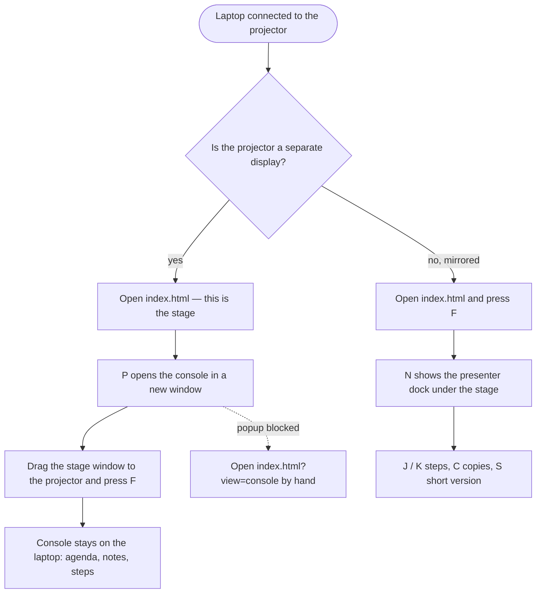
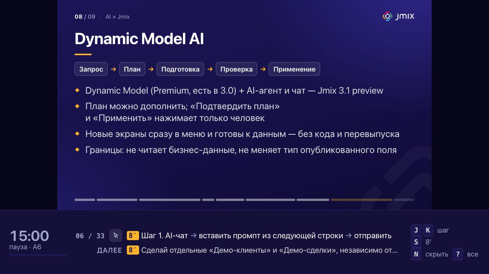
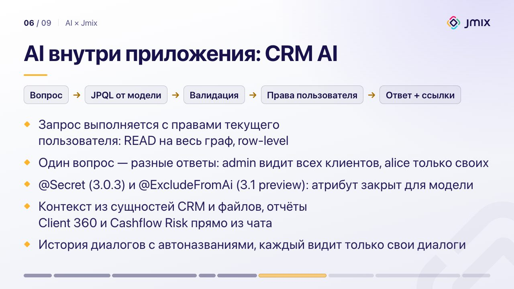

[Русский](../ru/usage.md) · **English** · [← README](../../../README.en.md)

# Running a demo

The runbook is one page with three views: the **stage** for the audience, the presenter **console**, and the **mirror dock** at the bottom of the stage. This guide covers connecting them to a projector, every key, the time plan, the steps, and what to do when something goes wrong. The interface itself is in Russian; on-screen labels are quoted below with a translation.

- [Starting](#starting)
- [Second screen or mirror](#second-screen-or-mirror)
- [Keys](#keys)
- [Time plan and exit points](#time-plan-and-exit-points)
- [Steps and the short version](#steps-and-the-short-version)
- [Pre-flight](#pre-flight)
- [Troubleshooting](#troubleshooting)

## Starting

- **Online:** <https://fedoseew.github.io/jmix-demo-runbook/>.
- **Offline:** clone the repository (or download the ZIP) and double-click `index.html`. No server and no internet needed: `content.js`, `core.js` and `app.js` load by relative paths and the page makes no external requests.

Works in current Chrome, Edge, Firefox and Safari. The two-window setup on `file://` is verified in Chromium.

## Second screen or mirror

You don't always know in advance how the laptop will be connected to the projector, so the runbook supports both setups.



### Second screen

1. Open `index.html`. This is the stage.
2. Press `P`. The console opens in a new window (`index.html?view=console`) and tells you what to do next. If the browser blocks the popup, the stage says so; open `index.html?view=console` by hand.
3. Keep the console on the laptop, drag the stage window to the projector and press `F` in it.

The windows stay in sync: demo, block, step, short version and theme changed in one window show up in the other at once. Notes you expanded in the console stay expanded.

The console header shows:

- «Сцена · на связи» (stage online) while the stage window is open (it writes a heartbeat every 2 s), and «Сцена не найдена» (stage not found) once it is closed;
- «Окно не в фокусе» (window not focused) instead of the key legend when focus is elsewhere (after `F` in the stage window, or in Studio): `J`, `K`, `C`, `S` then go to the other window, so click the console;
- a link to the GitHub repository (opens in a new tab; in windows narrower than 1280px only its icon is shown; the stage never shows it);
- a clock, the only time on the presenter's screen: there is no timer.

The header always stays on one row from 1024px up: below 1280px the legend drops «1 2 демо» (the demo tabs show those keys). The `?` reference lists every key.

Without the dock, the stage shows no messages, since the audience would see them. The exceptions are the two you need during setup: a blocked console popup and unavailable `localStorage`. The stage key hint shows for 2.5 s after load and after mouse movement; in full screen the cursor hides.

### Mirror

1. Open `index.html`, press `F`.
2. Press `N`. The presenter dock appears at the bottom: the current step with copy, and the next step. The slide shrinks but stays 16:9.
3. `J` / `K` move through steps, `C` copies the current one, `S` toggles the short version (the counter shows «8′ короткая»), `N` hides the dock. There is no console in mirror mode, so `?` opens the full key reference; the audience sees it too.

The audience sees the dock, so it has no notes.

Studio steps and lines to say are shown in full in the dock; copyable steps take up to three lines. The dock's height follows the longest step of the block (at most 30% of the screen), so the slide resizes only when the block changes, not on every `J`. Messages (copied, step can't be copied) replace the key legend in the dock instead of covering the slide.



## Keys

Keys are matched by their physical position (`event.code`), so they work in any keyboard layout. Keys with `Ctrl`, `Alt` or `Cmd` and keys typed in input fields are ignored; `Space` is ignored on buttons, links, notes and checkboxes. Key auto-repeat is ignored, so holding `→` does not skip blocks.

| Key | Action | Where |
|---|---|---|
| `←` / `→` | previous / next block | everywhere |
| `1` / `2` | demo A / B | everywhere |
| `F` | full screen | everywhere |
| `L` | light stage for a bright room | everywhere |
| `?` (`/` with or without `Shift`) | full key reference; `?`, `Esc` or a click outside closes it | everywhere |
| `P` | open the console in a new window | stage |
| `N` | mirror dock | stage |
| `J` / `Space` | next step | console; stage with the dock |
| `K` | previous step | console; stage with the dock |
| `C` | copy the current step (for a Studio step or a line to say, a message explains it can't be copied) | console; stage with the dock |
| `S` | short version: only steps marked `[8]` | console; stage with the dock |

With the mouse in the console: click an agenda segment to jump to that block, a step to make it current, a copy button to copy the step and make it current, «Раскрыть все» to expand all notes.

The light stage (`L`) is for a room where the lights stay on:



## Time plan and exit points

There is no live timer: check the time against the clock in the console header.

- **Each block is planned in minutes.** Agenda segments are as wide as their minutes and labelled «12′»; the demo total is in the agenda heading. The block notes say what to reach by which minute («Вход и вопрос 1, минуты 0–3», login and question 1, minutes 0–3).
- **Exit points** say what to cut when time runs short. The agenda marks them with a pink bar, the next card with a «выход» (exit) tag, and the current block shows its exit point under the stage thumbnail (on A6: «короткая версия», the short version, with `S`). The presenter decides.
- The strip at the bottom of the slide shows the audience only done / now / ahead, with no time.

## Steps and the short version

The «Действия» (actions) column in the console lists the block's numbered steps. The icon shows the step type:

| Type | What it is | Copyable |
|---|---|---|
| Terminal (`shell`) | a command | yes |
| Git (`git`) | a git command | yes |
| Link (`url`) | an address, opens in a new tab | yes |
| Studio (`studio`) | a Studio menu path or a manual action | no |
| Say (`say`) | a key line for the audience | no |
| Prompt | a question to a model (CRM AI, Jmix AI, the report designer) | yes |

- The current step is highlighted and scrolled into the top third of the column; finished steps are dimmed. Each block remembers its step.
- **Short version.** Steps marked `[8]` get an «8′» badge. `S` (or the «короткая версия» toggle) keeps only those steps, and `J` / `K` move only through them. Today only A6 has a short version: it is exit point 2.
- **Prompts.** Questions to a model are never typed live: a step containing «… промпт из следующей строки …» ("prompt on the next line") turns the next Studio step into a copyable prompt. Copy with `C`, paste into the chat with `Cmd+V`.
- The «Далее» (next) card in the console shows the first steps of the next block, so you can open tabs ahead of time.

## Pre-flight

The first block of each demo (A-pre, B-pre) is the setup before the audience arrives.

- **The audience sees a holding slide**: «Живое демо» (live demo), the demo name, the agenda without ids, and a QR code for the repository `github.com/Fedoseew/jmix-demo-runbook`, so people can open the materials on their phones while the room fills up.

  

- **The presenter sees a checklist** in the console (the «3/11 отмечено» count, ticked, is in the column header; in a window narrower than 1100px only «3/11»). Ticks live in the window until F5: moving between blocks, `L` and switching demos keep them. Below the checklist are the setup notes; the «Действия» (actions) column on the right holds the setup steps: the `./demo` commands and the manual checks (Studio, the A2 agent, the browser).

The last block of each demo (A7, B5) tells the audience where to find the materials.

**The infrastructure** of the demos comes up with the `./demo` script in the runbook folder; what runs where and every command are in [Demos A and B → What to prepare](demos.md#what-to-prepare).

```bash
./demo setup                     # once: the jmix-crm-stand worktree, the stand jar, a clone of crm-from-db
./demo up a                      # the stand on :8091; ./demo up b also starts PostgreSQL on :5434 for demo B
./demo reset && ./demo prepare   # the day before, after the rehearsal: fresh database, A4 dialogs, screenshots
./demo reset b                   # after a demo B rehearsal: the database from the dump, then the app and the user sales
./demo check                     # pre-flight: PASS / WARN / FAIL, exit code 1 on any FAIL
./demo down                      # after the demo
```

Instead of `./demo up a` you can start the stand in IntelliJ IDEA: project `~/IdeaProjects/jmix-crm-stand`, run configuration «Stand aura-light (OpenAI)»; the other commands work with it too.

Before the talk:

1. `./demo check` with no FAIL, then the manual items of the pre-flight checklist.
2. **Clear the rehearsal state.** The step of each block, the short version and the last block of each demo live in `localStorage` and survive a browser restart: without a reset, A4 opens halfway through. In the console on pre-flight, press «Сбросить репетицию» (reset rehearsal) under the checklist, then press it again within 3 s; meanwhile the button reads «Нажмите ещё раз» (press again). From the keyboard: `Tab` to the button, `Enter` twice. Blocks then open at their first step and the other demo at its pre-flight; the stage theme and the checklist ticks stay, and the stage window updates by itself.
3. Rehearse once in mirror mode on the real projector: on blocks with long Studio steps (A5, A6, B2) the dock takes up to 30% of the screen.
4. Close the items in [docs/open-questions.md](../../open-questions.md) (partly in Russian) that apply to your venue.

## Troubleshooting

| Symptom | Cause and fix |
|---|---|
| `P` does not open the console | The browser blocked the popup. Allow popups for the page or open `index.html?view=console` by hand. |
| Console keys do nothing, the header says «Окно не в фокусе» | Focus is in the stage window or another app. Click the console. |
| «Сцена не найдена» (stage not found) | The stage window is closed or open in another browser profile. Both windows must be in the same browser and profile. |
| «localStorage недоступен» (localStorage unavailable) | Private mode or blocked storage. The second window won't sync and F5 starts over; use a normal window. |
| A message about `content.js` or `core.js` instead of the page | The file did not load or broke after a manual edit. Open `index.html` from the runbook folder and run `node --test`. |
| `C` says «Буфер обмена недоступен» (clipboard unavailable) | The browser blocked the Clipboard API. Select the step text and copy it by hand. |
| `C` says «Шаг не копируется» (step can't be copied) | The current step is a line to say or a Studio action. |
| `J`, `K`, `C`, `S` do nothing on the stage | They need the dock: press `N`, or open the console with `P`. |
| The console opens on the block and steps of the last rehearsal | Delete the `jmix-runbook/v1` key, see [Pre-flight](#pre-flight). |
| The stand does not answer or hangs on «Waiting for changelog lock» | `./demo logs` shows the tail of the stand log. After a `kill` or a reboot without a stop the stand database is broken: `./demo reset`. Stop the stand only with `./demo down` or one press of Stop in IDEA. |
| Bullets look small | The slide shrinks bullets that don't fit, but never below 28px at 1280 wide. Shorten the bullets or enlarge the window. |

---

Next: [demos A and B](demos.md) · [editing the content](content.md) · [architecture](architecture.md)
