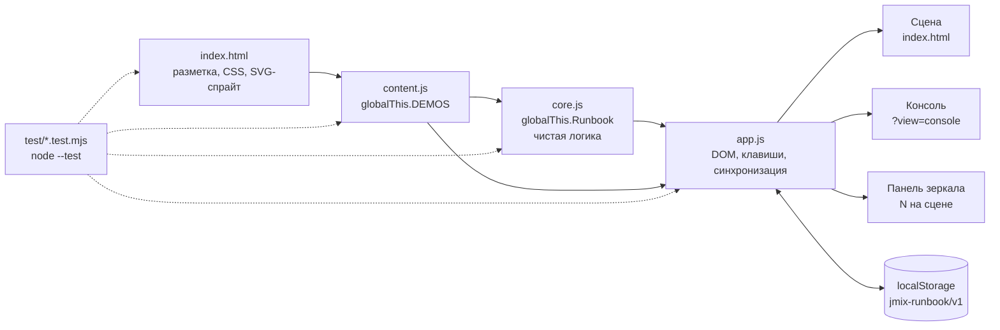
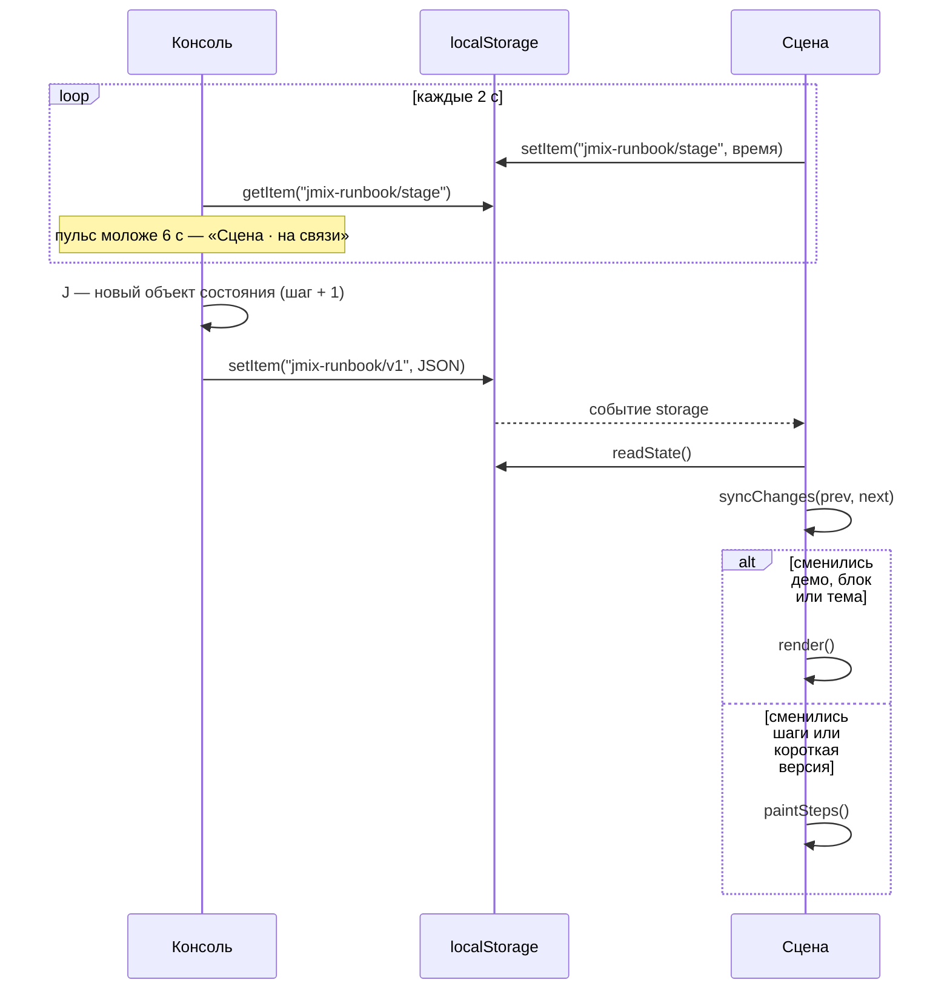

**Русский** · [English](../en/architecture.md) · [← README](../../../README.md)

# Архитектура

Статическая страница без сборки и зависимостей: три скрипта и `index.html`. Открывается с диска (`file://`) и с GitHub Pages одинаково, внешних запросов не делает.

- [Файлы](#файлы)
- [Состояние](#состояние)
- [Синхронизация двух окон](#синхронизация-двух-окон)
- [Виды](#виды)
- [Ограничения](#ограничения)
- [Тесты](#тесты)
- [Инструменты](#инструменты)

## Файлы

| Файл | Отвечает за |
|---|---|
| `index.html` | разметка, весь CSS (токены палитры в `:root`), SVG-спрайт (логотип, иконки шагов, QR репозитория), справка `?` (`<dialog id="keys">`), meta и Open Graph. Подключает `content.js`, `core.js`, `app.js` в этом порядке относительными путями |
| `content.js` | данные обоих демо — `globalThis.DEMOS` ([схема](content.md#схема-demos)) |
| `core.js` | чистая логика без DOM — `globalThis.Runbook`: загрузка и проверка состояния, сброс после репетиции (`resetRehearsal`), повестка, классификация шагов, лиды заметок, типографика, `flowOf`. Тестируется в Node |
| `app.js` | DOM: сцена, консоль, панель зеркала, клавиши, копирование, синхронизация окон |
| `demo` | bash-скрипт инфраструктуры демо, к странице не относится: стенд, база crm-from-db, pre-flight (`./demo help`, [что где работает](demos.md#что-подготовить)) |
| `test/` | `node --test`: `content`, `core`, `html`, `app`, `demo-script` и загрузчик `load.mjs` |
| `tools/` | `shot.mjs` (скриншот), `smoke.mjs` (смоук двух окон), `capture-fallbacks.mjs` (скриншоты-fallback со стенда демо, см. `assets/README.md`), `browser.mjs` (запуск Chromium для всех трёх), `StandKeyCheck.java` (`./demo check` спрашивает стенд по JMX, заданы ли ключи; печатает только set или missing) |
| `.agents/skills/` | skills для агентов; в `.claude/skills/` — относительные символьные ссылки на них. На Windows включите ссылки до клонирования (`git config --global core.symlinks true` в режиме разработчика) или скопируйте `.agents/skills/*` в `.claude/skills/` |



Если `content.js` или `core.js` не загрузился (опечатка при правке, старый браузер), `app.js` пишет причину вместо пустого экрана. В `core.js` нет lookbehind в регулярных выражениях: Safari до 16.4 уронил бы файл целиком.

## Состояние

**Общее для окон** — объект в `localStorage` под ключом `jmix-runbook/v1`:

| Поле | Что хранит |
|---|---|
| `demo` | `'a'` или `'b'` |
| `index` | номер текущего блока в демо |
| `indexByDemo` | позиция в каждом демо: случайное `2` → `1` из любого окна возвращает на тот же блок |
| `steps` | текущий шаг каждого блока: `{ A4: 3, … }` |
| `short` | короткая версия включена |
| `light` | светлая сцена |

`Runbook.loadState` проверяет тип каждого поля, отбрасывает лишнее и читает состояние старых версий: без `indexByDemo` и с полями удалённого таймера (`timer`, `elapsed` — отбрасываются). Состояние не мутируется: каждое изменение собирает новый объект и записывает его целиком (`saveState`). Обращения к хранилищу — в `try/catch`.

`Runbook.resetRehearsal` — кнопка «Сбросить репетицию» под чек-листом pre-flight в консоли (второй щелчок за 3 с): новое состояние без шагов, короткой версии и `indexByDemo`, демо, блок и тема те же. Второе окно получает событие `storage` и перекрашивает шаги.

**Своё у окна:**

- вид — из адреса (`?view=console` или сцена), в хранилище не пишется;
- открыта ли панель зеркала — `sessionStorage`, ключ `jmix-runbook/dock`: переживает F5 только в этой вкладке;
- отметки чек-листа pre-flight — в памяти окна до F5.

**Пульс.** Окно сцены раз в 2 с пишет время в `jmix-runbook/stage`. Консоль считает сцену открытой, пока пульсу меньше 6 с, и показывает «Сцена · на связи» или «Сцена не найдена».

## Синхронизация двух окон

Окна не обращаются друг к другу напрямую: на `file://` у страницы opaque origin, и доступ к `window.opener` заблокирован. Связь — через `localStorage` и событие `storage`, которое браузер присылает всем остальным окнам того же origin.



`Runbook.syncChanges` решает, что перерисовать. Полная перерисовка — только при смене демо, блока или темы; смена шага или короткой версии красится точечно (`paintSteps`), поэтому раскрытые в консоли заметки не схлопываются.

## Виды

| Вид | Как открыть | Что внутри |
|---|---|---|
| Сцена | `index.html` | слайд 16:9 в контейнере с `container-type: inline-size`: счётчик, заголовок, жёлтая черта, полоса `flow`, тезисы, полоса прогресса. Для pre-flight — заставка с программой и QR. Тезисы ужимает `fitStage` с `2.5cqw` до `2.19cqw` |
| Консоль | `P` на сцене или `index.html?view=console` | повестка, миниатюра сцены с точкой выхода блока, «Далее», заметки с лидами, шаги, ссылка на GitHub, часы |
| Панель зеркала | `N` на сцене | текущий и следующий шаг, легенда клавиш; высоту задаёт `sizeDock` по самому длинному шагу блока |
| Справка | `?` в любом виде | `<dialog id="keys">` со всеми клавишами |

Разметка собирается шаблонными строками; весь текст из контента проходит через `Runbook.esc` (экранирование) или `Runbook.typo` (экранирование и типографика сцены).

## Ограничения

- Ноль внешних запросов: ни CDN, ни шрифтов, ни `fetch`. Шрифты системные. Meta и Open Graph — не запросы.
- Работает с `file://`.
- Палитра Jmix: `#17124B`, `#FDB42B`, `#FC1264`, `#41B883`, текст `#DBDDE1`. Контраст текста не ниже 4.5:1 на фонах консоли и светлой панели.
- Размеры текста: тезисы сцены не мельче 28px при ширине 1280; консоль (её видит только докладчик) — не мельче 14px; панель зеркала и справка (их видит зал) — не мельче 18px.
- Клавиши — по `event.code`, чтобы работать в любой раскладке.
- `localStorage`, `sessionStorage`, буфер обмена, fullscreen и `window.open` — в `try/catch` или с проверкой результата.
- Без `console.log` в коде страницы.

## Тесты

```bash
node --test
```

- `test/load.mjs` выполняет файлы проекта в `node:vm` с подставными глобальными объектами — так `content.js` и `core.js` тестируются без браузера.
- `core.test.mjs` — логика: состояние (в том числе сохранённое старой версией с таймером), сброс репетиции, шаги, повестка, синхронизация, типографика, `flowOf`.
- `content.test.mjs` — правила контента (см. [content.md](content.md#проверка)).
- `html.test.mjs` — разметка и CSS: внешние ресурсы, порядок скриптов, контраст, размеры шрифтов, справка (клавиши в обе стороны: каждая обработанная есть в справке и наоборот), кнопка «Сбросить репетицию».
- `app.test.mjs` — `app.js` без `content.js` или `core.js` пишет причину, а не падает.
- `demo-script.test.mjs` — `bash -n demo`, `./demo help` перечисляет все подкоманды, неизвестная завершается с кодом 2.

Поведение в браузере проверяют инструменты ниже.

## Инструменты

Оба инструмента ищут Playwright так: переменная `PLAYWRIGHT_MODULE` (путь к модулю или имя пакета), иначе пакет `playwright`, иначе `playwright-core`. Браузер — из `CHROME_PATH`, если задан, иначе тот, что установил Playwright. Без глобальной установки:

```bash
npm i --no-save playwright && npx playwright install chromium
```

**`tools/shot.mjs`** — скриншот в заданном состоянии:

```bash
node tools/shot.mjs <url|путь> <out.png|out.jpg> [stateJSON|-] [ширина] [высота] [клавиши]
node tools/shot.mjs index.html /tmp/a6-dock.png '{"demo":"a","index":8}' 1280 720 KeyN,KeyJ
```

`stateJSON` кладётся в `localStorage['jmix-runbook/v1']` перед перезагрузкой, клавиши — коды `KeyboardEvent.code` через запятую. JPEG (качество 82) или PNG — по расширению. Снимок консоли (`?view=console`) получает свежий пульс сцены и показывает её «на связи». Печатает ошибки страницы и внешние запросы и в этом случае выходит с кодом 1. `SHOT_DELAY_MS` (по умолчанию 400) — пауза перед снимком; 3000 дождётся, пока скроется подсказка клавиш сцены.

**`tools/smoke.mjs`** — смоук двух окон: сцена, `P` открывает консоль, переход на A4, `J` ×3, панель сцены показывает тот же шаг, после перезагрузки обоих окон блок и шаг на месте, нет ошибок и внешних запросов. Печатает строки `PASS` / `FAIL`, при сбое выходит с кодом 1.

```bash
node tools/smoke.mjs            # index.html рядом с tools/
node tools/smoke.mjs https://fedoseew.github.io/jmix-demo-runbook/
```

---

Дальше: [как вести демо](usage.md) · [демо A и B](demos.md) · [как править контент](content.md)
