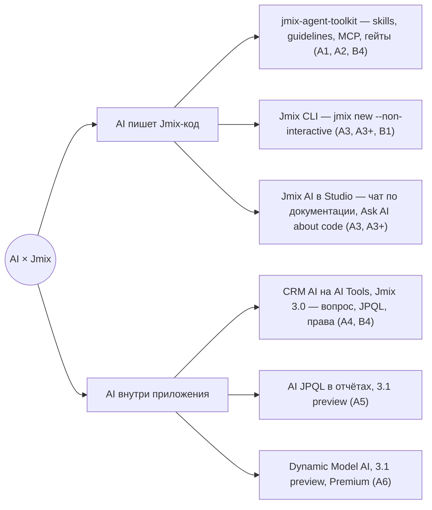
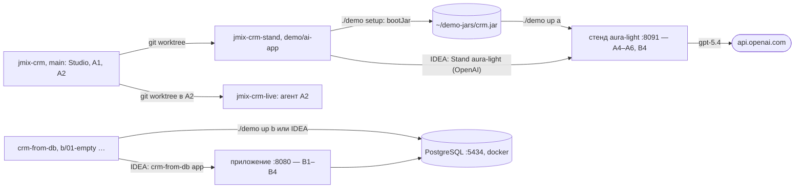

**Русский** · [English](../en/demos.md) · [← README](../../../README.md)

# Демо A и B

Два живых демо Jmix для двух аудиторий. Главный принцип — минимум живой генерации кода на сцене: каждый шаг заранее подготовлен в ветке или на стенде, у каждого AI-шага есть запасной вариант. Полный план и обоснования — в [spec](../../superpowers/specs/2026-10-07-jmix-demo-runbook-design.md) (§3–4, §6–7).

- [Карта «AI × Jmix»](#карта-ai--jmix)
- [Демо A — «AI × Jmix»](#демо-a--ai--jmix)
- [Демо B — «Jmix с нуля»](#демо-b--jmix-с-нуля)
- [Что подготовить](#что-подготовить)
- [Что можно попробовать уже сейчас](#что-можно-попробовать-уже-сейчас)

## Карта «AI × Jmix»

Демо A идёт по двум осям: AI помогает писать Jmix-код и AI работает внутри Jmix-приложения. В скобках — блоки, где инструмент показывается.



## Демо A — «AI × Jmix»

**Аудитория:** разработчики с опытом работы на Jmix около года. **Длительность:** ядро 73 минуты, с опциональным A3+ — 80; Q&A входит в A7.

**Цели:** показать, как AI-агент пишет Jmix-код и почему Jmix для этого удобен (Spring Boot, метаданные и XSD ловят ошибки до запуска, security by default, UI на Java); показать AI внутри приложения — ответы по данным с учётом прав, AI-запросы в отчётах, изменение модели данных словами; честно назвать границы.

```mermaid
gantt
  title Демо A «AI × Jmix» — 73 мин ядро, 80 с опцией
  dateFormat HH:mm
  axisFormat %H:%M
  section Разработка с AI
  A0 Карта «AI × Jmix»            :a0, 00:00, 5m
  A1 Окружение агента             :a1, after a0, 10m
  A2 Агент делает фичу            :a2, after a1, 15m
  A3 Jmix CLI и Jmix AI           :a3, after a2, 3m
  Точка выхода 1 — пропустить A3+ :milestone, x1, after a3, 0m
  A3+ Мастер CLI, Ask AI (опц.)   :active, a3p, after a3, 7m
  section AI внутри приложения
  A4 CRM AI                       :a4, after a3p, 12m
  A5 AI JPQL в отчётах            :a5, after a4, 8m
  A6 Dynamic Model AI             :a6, after a5, 15m
  Точка выхода 2 — A6 за 8 мин    :milestone, x2, after a5, 0m
  section Итоги
  A7 Итоги и Q&A                  :a7, after a6, 5m
```



Светлая полоса — опциональный блок, ромб — точка выхода.

| # | Блок | Мин | Что показывает |
|---|---|---|---|
| A-pre | Pre-flight | — | Чек-лист подготовки; зал видит заставку с программой и QR-кодом репозитория |
| A0 | Карта «AI × Jmix» | 5 | Две оси, почему Jmix удобен агенту, бенчмарк Haulmont «Jmix против Spring» и честно — агент выдумывает API, ловим инспекциями, тестами и ревью |
| A1 | Окружение агента: jmix-agent-toolkit | 10 | Установка toolkit (Studio 3.0+ или `install.sh`), что появилось в проекте: skills, guidelines, MCP, Playwright; хаб-skill `jmix` и гейты |
| A2 | Агент делает фичу | 15 | Задача «Contract: сущность, список, карточка, роль, тест» на jmix-crm: 3 минуты live, затем готовый результат из ветки `demo/agent-task`; где фреймворк ловит ошибки |
| A3 | Jmix CLI и Jmix AI | 3 | `jmix --no-update new … --non-interactive`, в новом проекте сразу `.skills`; один вопрос Jmix AI. **Точка выхода №1:** при отставании — сразу к A4 |
| A3+ | Мастер CLI и Ask AI about code | 7, опц. | Мастер `jmix --no-update` до фазы Location and setup, затем выход; строка «CLI command:» — со скриншота репетиции; Ask AI about code по выделенному коду |
| A4 | AI внутри приложения: CRM AI | 12 | Вопрос → JPQL → валидация → ответ со ссылками; один вопрос под admin и alice — разные ответы; `@Secret`, `@ExcludeFromAi`; Client 360 из чата |
| A5 | AI JPQL в отчётах | 8 | Новый тип набора данных в отчёте: промпт → «Сгенерировать запрос» → JPQL виден и правится; запуск без модели с правами пользователя |
| A6 | Dynamic Model AI | 15 | Описание словами → план → «Подтвердить план» → «Применить» → экраны сразу в меню; границы агента. **Точка выхода №2:** короткая версия на 8 минут — шаги `[8]` |
| A7 | Итоги и Q&A | 5 | Что доступно уже (3.0) и что в 3.1 preview, как начать завтра, где материалы демо |

## Демо B — «Jmix с нуля»

**Аудитория:** разработчики, которые только знакомятся с Jmix. **Длительность:** ядро 45 минут, с опциональным B4 — 55; по точке выхода B4 занимает 3 минуты — 48.

**Цели:** объяснить, что такое Jmix и где он уместен, создать проект двумя путями (Studio и CLI), за 15 минут получить работающее приложение из существующей базы, доработать его руками и показать мост к AI.

```mermaid
gantt
  title Демо B «Jmix с нуля» — 45 мин ядро, 55 с опцией
  dateFormat HH:mm
  axisFormat %H:%M
  section Знакомство
  B0 Что такое Jmix                 :b0, 00:00, 8m
  B1 Проект двумя путями            :b1, after b0, 7m
  section Приложение
  B2 Приложение из существующей БД  :b2, after b1, 15m
  B3 Доработка руками в Studio      :b3, after b2, 10m
  section Мост к AI
  Точка выхода — только 3 мин CRM AI :milestone, x1, after b3, 0m
  B4 Мост к AI (опц.)               :active, b4, after b3, 10m
  section Итоги
  B5 Итоги                          :b5, after b4, 5m
```



| # | Блок | Мин | Что показывает |
|---|---|---|---|
| B-pre | Pre-flight | — | Чек-лист подготовки; зал видит заставку с программой и QR-кодом репозитория |
| B0 | Что такое Jmix | 8 | Spring Boot + Vaadin Flow + JPA, Studio и add-ons; где Jmix хорош и где не стоит; лицензии |
| B1 | Проект двумя путями: Studio и CLI | 7 | Studio New Project и мастер `jmix --no-update` — одни шаблоны; `--non-interactive` для скриптов и агентов; структура проекта, запуск, вход |
| B2 | Приложение из существующей БД | 15 | PostgreSQL с CRM-схемой → Generate Model from Database → сущности со связями → экраны списка и карточки → запуск с реальными данными: сортировка, фильтр и поля по типу атрибута без UI-кода; Liquibase не трогает существующие таблицы |
| B3 | Доработка руками в Studio | 10 | Атрибут `rating` вживую, Studio пишет changelog на одну колонку; готовая роль «Manager: Clients read-only» из `b/04-role`, назначение и вход менеджером |
| B4 | Мост к AI | 10, опц. | Toolkit в том же проекте, один промпт «list view для Invoice» → результат из ветки `b/05-agent`; тизер CRM AI. **Точка выхода:** при отставании — только 3 минуты CRM AI |
| B5 | Итоги | 5 | Полоса итога от существующей БД до роли менеджера; документация, trial Studio, онлайн-демо, форум, шаг на завтра, где материалы демо |

## Что подготовить

Runbook ссылается на ветки, стенды и порты по именам из spec §6–7. Демо-ветки и репозиторий демо B готовы и лежат на GitHub; как повторить демо по ним — в разделе [Что можно попробовать уже сейчас](#что-можно-попробовать-уже-сейчас).

**Репозитории и ветки**

| Что | Откуда | Для чего |
|---|---|---|
| [`jmix-crm`](https://github.com/jmix-framework/jmix-crm), ветка [`demo/ai-app`](https://github.com/jmix-framework/jmix-crm/tree/demo/ai-app) | от [`50-dynmodel-ai-agent`](https://github.com/jmix-framework/jmix-crm/tree/50-dynmodel-ai-agent) | стенд `aura-light`, скрипт `demo/dynmodel-ai-agent/stands.sh` и run-конфигурация «Stand aura-light (OpenAI)», демо-данные A4–A6, `@ExcludeFromAi` на `Contact.phone` и `Contact.email`, JPQL в логе (DEBUG), архив отчётов `demo/reports/ai-jpql-reports.zip` (стенд импортирует его сам) |
| `jmix-crm`, ветка [`demo/agent-task`](https://github.com/jmix-framework/jmix-crm/tree/demo/agent-task) | от `main` | промпт A2 в `demo/PROMPT.md` и результат агента одним коммитом с доказательствами гейтов |
| [`crm-from-db`](https://github.com/Fedoseew/crm-from-db) | `jmix new`, Jmix 3.0.3 | `db/docker-compose.yml` (PostgreSQL 17.11 на порту 5434) и `db/crm.sql` (дамп схемы и данных CRM), ветки `b/01-empty` → `b/02-model` → `b/03-views` → `b/04-role` → `b/05-agent`, run-конфигурации IDEA в `.run/` |

**Инфраструктура: `./demo`**

Стенд, базу и pre-flight поднимает скрипт `./demo` в корне runbook (bash, macOS и Linux). Проекты лежат в `~/IdeaProjects`: `jmix-crm` всё время на `main` (Studio, A1 и A2), стенд живёт в отдельном worktree `jmix-crm-stand` на ветке `demo/ai-app`, демо B — в `crm-from-db`. `./demo` без команды открывает меню: действия сгруппированы по демо, рядом с каждым — команда, которую оно выполняет; Ctrl+C останавливает команду и возвращает в меню.



| Команда | Что делает | Когда |
|---|---|---|
| `./demo setup` | worktree `jmix-crm-stand` (если его нет), `./gradlew bootJar` в нём, атомарная копия jar в `~/demo-jars/crm.jar`, клон `crm-from-db` (если его нет) и переход чистого клона на `b/01-empty`, Playwright с Chromium для `prepare` (если не стартует); при работающем стенде отказывается | один раз и после изменений `demo/ai-app` |
| `./demo up a`, `./demo up b` | стенд `aura-light` на `:8091`, ждёт HTTP 302 (до 120 с); `b` — ещё PostgreSQL на `:5434`, ждёт таблицы CRM. Стенд, уже запущенный из IDEA, видит и второй не стартует | перед репетицией и в день демо |
| `./demo prepare` | `tools/capture-fallbacks.mjs a4 b4 a5`: прогрев CRM AI, диалоги A4 под admin и alice, тизер B4, отчёт A5, скриншоты в `assets/` | накануне, после `./demo reset` |
| `./demo check [a\|b\|all]` | pre-flight: таблица PASS / WARN / FAIL, код выхода 1 при FAIL; каждая строка FAIL говорит, что сделать. Нет скриншота-fallback — WARN; в демо B ещё колонка `client.rating` и пользователь sales без ролей | накануне и в день демо |
| `./demo reset [a\|b] [-y]` | `a` (по умолчанию): остановить стенд, удалить его базу и файлы, запустить свежий; отчёты A5 стенд импортирует сам. `b`: удалить том PostgreSQL, заново загрузить дамп, перевести чистый `crm-from-db` на `b/01-empty`; затем один раз запустить «crm-from-db app» и создать пользователя sales / sales | после репетиции или при «Waiting for changelog lock» |
| `./demo down` | остановить стенд (корректно, через JMX) и PostgreSQL; данные базы остаются в томе | после демо |
| `./demo status`, `./demo logs [jpql]` | что где запущено; хвост лога стенда или строки `executeQuery(jpql=` | в любой момент |

Стенд запускается двумя равноценными способами: `./demo up a` — из jar, или в IntelliJ IDEA — проект `~/IdeaProjects/jmix-crm-stand`, run-конфигурация «Stand aura-light (OpenAI)» (из исходников, с теми же аргументами; «CRM APP» в этом проекте — не стенд и занимает порт 8080 демо B, её не запускать). Оба используют порт 8091, JMX-порт 9191, одну базу и один лог, поэтому остальные команды работают с любым; запускать один из двух. Демо B в IDEA: проект `crm-from-db`, run-конфигурация «crm-from-db app» (порт 8080) перед стартом запускает «crm-from-db database» (`db/db.sh up`: Docker Compose, ждёт готовности и проверяет 8 таблиц CRM); «crm-from-db database reset» (`db/db.sh reset`) — то же, что `./demo reset b`, но без переключения ветки. Ключ `SPRING_AI_OPENAI_APIKEY` берётся только из окружения (в run-конфигурации — плейсхолдер `${SPRING_AI_OPENAI_APIKEY:setup-required}`; умолчание не убирать: голый `${NAME}` IDEA подставляет сама из своего окружения, и значение ключа попало бы в командную строку java) и нигде не печатается; IDEA на macOS читает окружение при своём запуске, поэтому после правки `~/.zshrc` её надо перезапустить.

**Стенды и окружение**

- JDK 21+ (именно JDK, не JRE) в `PATH` или `JAVA_HOME`; Docker с PostgreSQL из дампа (демо B).
- Jar стенда собирает `./demo setup` накануне: ветке нужны Jmix и Jmix Premium 3.1.999-SNAPSHOT в local Maven (для Premium нужен доступ); если их нет, команда печатает команды публикации. Стенд один — `aura-light` на `:8091`; запасной вариант A6 — скриншоты `assets/a6-*.png`.
- Ключ проверяется только на наличие: `SPRING_AI_OPENAI_APIKEY`, им пользуются CRM AI и агент Dynamic Model (оба на `gpt-5.4`: `./demo up a` и run-конфигурация всегда запускают агента на OpenAI). `./demo check a` ещё спрашивает у запущенного стенда по JMX, есть ли у него ключ, без значения.
- Studio открыт на `jmix-crm` и на проекте B, индексация завершена, Jmix AI ответил на пробный вопрос; `jmix --help` отвечает, команда A3 прогнана в запасной каталог.
- Интернет для AI-блоков (A3, A4–A6, B4) или hotspot. Запасные варианты: диалоги в «Истории» CRM AI (их записывает `./demo prepare`), скриншоты в `assets/` рядом с runbook: их снимают локально на репетиции (A4, A5 и тизер B4 — `./demo prepare`, итог A6 — `tools/capture-fallbacks.mjs a6` после прогона сценария, список всех файлов — `assets/README.md`); сами PNG в `.gitignore` и в репозиторий не попадают.

Автоматическая часть pre-flight — `./demo check`, ручные пункты — в блоках A-pre и B-pre (консоль, `?view=console`). Что ещё не проверено и должно закрыться на репетиции — [docs/open-questions.md](../../open-questions.md).

## Что можно попробовать уже сейчас

Оба демо можно повторить на публичных репозиториях и стендах:

- [`jmix-crm`](https://github.com/jmix-framework/jmix-crm), ветка `main` — B2B CRM с CRM AI (A4) и база для задачи агента (A2); ветка [`demo/agent-task`](https://github.com/jmix-framework/jmix-crm/tree/demo/agent-task) — промпт и результат агента: `git log --oneline -3` и `git diff --stat main...demo/agent-task`, как в A2.
- Ветка [`demo/ai-app`](https://github.com/jmix-framework/jmix-crm/tree/demo/ai-app) — стенд A4–A6: сборка и запуск по `demo/dynmodel-ai-agent/README_ru.md`, раздел «Ветка demo/ai-app». Нужны Jmix и Jmix Premium 3.1.999-SNAPSHOT из local Maven (для Premium нужен доступ), ключ `SPRING_AI_OPENAI_APIKEY` (`OPENROUTER_API_KEY` — по желанию); основа ветки — [`50-dynmodel-ai-agent`](https://github.com/jmix-framework/jmix-crm/tree/50-dynmodel-ai-agent). Из клона runbook то же делают `./demo setup` и `./demo up a`.
- [`crm-from-db`](https://github.com/Fedoseew/crm-from-db) — демо B целиком: `docker compose -f db/docker-compose.yml up -d`, затем `./gradlew bootRun` на нужной ветке `b/01-empty` … `b/05-agent`; вход admin / admin.
- [demo.jmix.io/b2b-crm](https://demo.jmix.io/b2b-crm/login) — та же CRM онлайн, без установки.
- [jmix-agent-toolkit](https://github.com/jmix-framework/jmix-agent-toolkit) — skills, guidelines и MCP для своего агента (A1, A2, B4).
- [jmix-cli](https://github.com/jmix-framework/jmix-cli) — проект из терминала, как в A3 и B1:

  ```bash
  jmix --no-update new crm-cli --non-interactive --template application --locales en,ru
  ```

---

Дальше: [как вести демо](usage.md) · [как править контент](content.md) · [архитектура](architecture.md)
