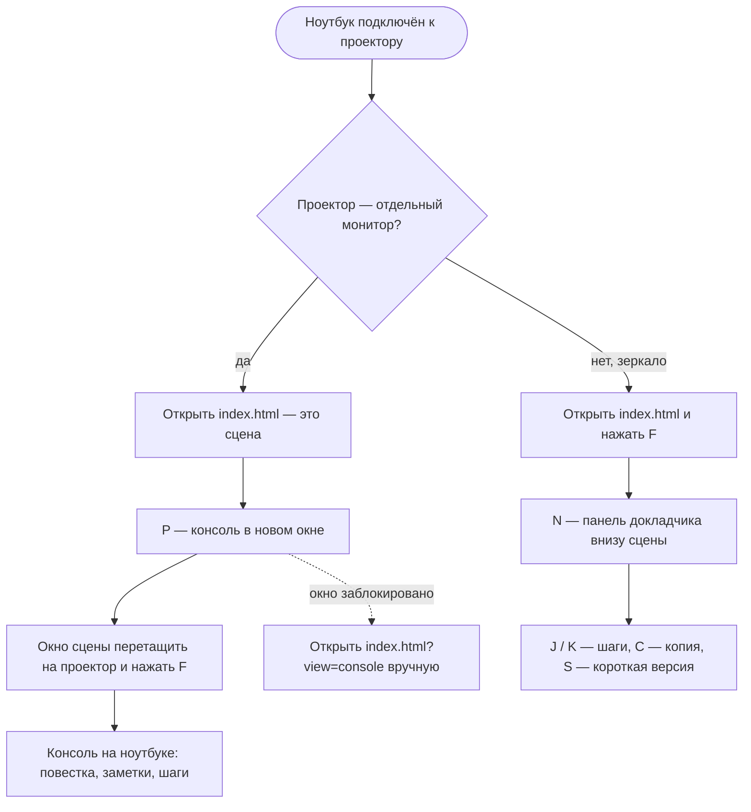

**Русский** · [English](../en/usage.md) · [← README](../../../README.md)

# Как вести демо

Runbook — одна страница с тремя видами: **сцена** для зала, **консоль** докладчика и **панель зеркала** внизу сцены. Ниже — как их подключить к проектору, все клавиши, план по времени, шаги и что делать, если что-то пошло не так.

- [Запуск](#запуск)
- [Второй экран или зеркало](#второй-экран-или-зеркало)
- [Клавиши](#клавиши)
- [План и точки выхода](#план-и-точки-выхода)
- [Шаги и короткая версия](#шаги-и-короткая-версия)
- [Pre-flight](#pre-flight)
- [Если что-то не так](#если-что-то-не-так)

## Запуск

- **Онлайн:** <https://fedoseew.github.io/jmix-demo-runbook/>.
- **Офлайн:** склонировать репозиторий (или скачать ZIP) и открыть `index.html` двойным щелчком. Сервер и интернет не нужны: `content.js`, `core.js` и `app.js` подключаются относительными путями, внешних запросов страница не делает.

Работает в свежих Chrome, Edge, Firefox и Safari. Для двух окон на `file://` проверен Chromium.

## Второй экран или зеркало

Заранее не всегда известно, как ноутбук подключат к проектору, поэтому runbook поддерживает обе схемы.



### Второй экран

1. Открыть `index.html` — это сцена.
2. Нажать `P`: консоль откроется в новом окне (`index.html?view=console`) и подскажет следующий шаг. Если браузер заблокировал окно, сцена об этом напишет — тогда открыть `index.html?view=console` вручную.
3. Консоль оставить на ноутбуке, окно сцены перетащить на проектор и нажать в нём `F`.

Окна синхронны: демо, блок, шаг, короткая версия и тема, переключённые в одном окне, сразу видны в другом. Раскрытые в консоли заметки при этом не схлопываются.

В шапке консоли:

- «Сцена · на связи», пока окно сцены открыто (оно раз в 2 с пишет пульс), и «Сцена не найдена», если его закрыли;
- «Окно не в фокусе» вместо легенды клавиш, если фокус ушёл (после `F` в окне сцены или в Studio): `J`, `K`, `C`, `S` уходят в другое окно — щёлкните по консоли;
- ссылка на репозиторий GitHub (открывается в новой вкладке; в окне уже 1280px — только значок; на сцене её нет);
- часы — единственное время на экране докладчика, таймера нет.

Шапка всегда в одну строку, от 1024px: в окне уже 1280px из легенды пропадает «1 2 демо» (эти клавиши есть на вкладках демо). Все клавиши — в справке `?`.

Сцена без панели сообщений не показывает — их увидел бы зал. Исключение — то, без чего не обойтись при подготовке: заблокированное окно консоли и недоступный `localStorage`. Подсказка клавиш сцены видна 2,5 с после загрузки и движения мыши, в полном экране курсор прячется.

### Зеркало

1. Открыть `index.html`, нажать `F`.
2. Нажать `N`: внизу появится панель докладчика — текущий шаг с копированием и следующий шаг. Сцена ужимается, но остаётся 16:9.
3. `J` / `K` листают шаги, `C` копирует текущий, `S` включает короткую версию (у счётчика появляется «8′ короткая»), `N` скрывает панель. Консоли в зеркале нет, поэтому `?` открывает справку по всем клавишам; её видит и зал.

Панель видит зал, поэтому заметок в ней нет.

Шаг Studio и реплика в панели показываются целиком, копируемые шаги — до трёх строк. Высота панели — по самому длинному шагу блока (не выше 30% экрана), поэтому слайд меняет размер только со сменой блока, а не на каждом `J`. Сообщения («Скопировано», «Шаг не копируется») встают в панель на место легенды клавиш, а не поверх слайда.


## Клавиши

Клавиши распознаются по физическому положению (`event.code`), поэтому работают и в русской раскладке. С `Ctrl`, `Alt`, `Cmd` и в полях ввода не перехватываются; `Space` не перехватывается на кнопках, ссылках, заметках и чекбоксах. Автоповтор зажатой клавиши игнорируется: зажатая `→` не пролистывает блоки.

| Клавиша | Действие | Где |
|---|---|---|
| `←` / `→` | предыдущий / следующий блок | везде |
| `1` / `2` | демо A / B | везде |
| `F` | полный экран | везде |
| `L` | светлая сцена для освещённого зала | везде |
| `?` (`/` с `Shift` или без) | справка по всем клавишам; закрывают `?`, `Esc` или щелчок мимо | везде |
| `P` | открыть консоль в новом окне | сцена |
| `N` | панель для зеркала | сцена |
| `J` / `Space` | следующий шаг | консоль; сцена с панелью |
| `K` | предыдущий шаг | консоль; сцена с панелью |
| `C` | копировать текущий шаг (на реплике и шаге Studio — сообщение, что шаг не копируется) | консоль; сцена с панелью |
| `S` | короткая версия: только шаги с меткой `[8]` | консоль; сцена с панелью |

Мышью в консоли: щелчок по сегменту повестки — переход к блоку, по шагу — сделать его текущим, по кнопке копирования — скопировать шаг и сделать его текущим, «Раскрыть все» — развернуть заметки.

Светлая сцена (`L`) — для зала, где не гасят свет:


## План и точки выхода

Живого таймера нет: время сверяют с часами в шапке консоли.

- **План блока — в минутах.** Ширина сегмента повестки пропорциональна минутам, у сегмента подпись «12′», сумма демо — в заголовке повестки. В заметках блоков расписано, что успеть к какой минуте («Вход и вопрос 1, минуты 0–3»).
- **Точки выхода** — что сокращать, если время поджимает. В повестке они отмечены розовой чертой, в «Далее» — меткой «выход», у текущего блока — строкой под миниатюрой сцены (у A6 — «короткая версия» и `S`). Решает докладчик.
- Полоса внизу слайда показывает залу только пройдено / сейчас / впереди, без времени.

## Шаги и короткая версия

Колонка «Действия» в консоли — нумерованные шаги блока. Тип шага виден по иконке:

| Тип | Что это | Копируется |
|---|---|---|
| Терминал (`shell`) | команда | да |
| Git (`git`) | git-команда | да |
| Ссылка (`url`) | адрес, открывается в новой вкладке | да |
| Studio (`studio`) | путь по меню Studio или действие руками | нет |
| Сказать (`say`) | ключевая фраза для зала | нет |
| Промпт | вопрос модели (CRM AI, Jmix AI, дизайнер отчётов) | да |

- Активный шаг подсвечен и прокручен в верхнюю треть колонки, пройденные приглушены. Шаг каждого блока запоминается.
- **Короткая версия.** Шаги с меткой `[8]` получают бейдж «8′». `S` (или переключатель «короткая версия») оставляет в блоке только их, и `J` / `K` проходят только по ним. Сейчас короткая версия есть у A6 — это точка выхода №2.
- **Промпты.** Вопросы модели не набираются на сцене: шаг «… промпт из следующей строки …» делает следующий шаг Studio копируемым промптом. Скопировать — `C`, вставить в чат — `Cmd+V`.
- Карточка «Далее» в консоли показывает первые шаги следующего блока, чтобы заранее открыть вкладки.

## Pre-flight

Первый блок каждого демо (A-pre, B-pre) — подготовка до прихода зала.

- **Зал видит заставку**: «Живое демо», название демо, программу без id и QR-код со ссылкой на репозиторий `github.com/Fedoseew/jmix-demo-runbook` — пока зал собирается, материалы можно открыть на телефоне.

  

- **Докладчик видит чек-лист** в консоли (счётчик «3/11 отмечено» — в шапке колонки; в окне уже 1100px — только «3/11»): отметки живут в окне до F5 — переходы между блоками, `L` и смена демо их не сбрасывают. Под чек-листом — заметки подготовки, справа в «Действиях» — шаги: команды `./demo` и ручные проверки (Studio, агент A2, браузер).

Последний блок каждого демо (A7, B5) говорит залу, где лежат материалы.

**Инфраструктуру** демо поднимает скрипт `./demo` из папки runbook; что где работает и все команды — в [Демо A и B → Что подготовить](demos.md#что-подготовить).

```bash
./demo                           # меню: те же действия по номеру
./demo setup                     # один раз: worktree jmix-crm-stand, jar стенда, клон crm-from-db
./demo up a                      # стенд :8091; ./demo up b — ещё PostgreSQL :5434 для демо B
./demo reset && ./demo prepare   # накануне после репетиции: свежая база, диалоги A4, скриншоты
./demo reset b                   # после репетиции B: база из дампа, затем приложение и пользователь sales
./demo check                     # pre-flight: PASS / WARN / FAIL, код выхода 1 при FAIL
./demo down                      # после демо
```

Вместо `./demo up a` стенд можно запустить в IntelliJ IDEA: проект `~/IdeaProjects/jmix-crm-stand`, run-конфигурация «Stand aura-light (OpenAI)»; остальные команды работают и с ним.

Перед демо:

1. `./demo check` без FAIL, затем ручные пункты чек-листа pre-flight.
2. **Сбросить состояние репетиции.** Шаги по блокам, короткая версия и последний блок каждого демо лежат в `localStorage` и переживают перезапуск браузера: без сброса A4 откроется на середине. В консоли на pre-flight под чек-листом нажать «Сбросить репетицию» и за 3 с ещё раз — кнопка в это время пишет «Нажмите ещё раз» (с клавиатуры: `Tab` до кнопки, дважды `Enter`). Блоки откроются с первого шага, другое демо — с pre-flight; тема сцены и отметки чек-листа остаются, окно сцены обновится само.
3. Один раз прогнать демо в режиме зеркала на реальном проекторе: на блоках с длинными шагами Studio (A5, A6, B2) панель занимает до 30% экрана.
4. Закрыть пункты [docs/open-questions.md](../../open-questions.md), которые касаются вашей площадки.

## Если что-то не так

| Симптом | Причина и что делать |
|---|---|
| После `P` консоль не открылась | Браузер заблокировал всплывающее окно. Разрешить окна для страницы или открыть `index.html?view=console` вручную. |
| Клавиши в консоли не действуют, в шапке «Окно не в фокусе» | Фокус в окне сцены или в другой программе. Щёлкнуть по консоли. |
| «Сцена не найдена» | Окно сцены закрыто или открыто в другом профиле браузера. Окна должны быть в одном браузере и одном профиле. |
| Сообщение «localStorage недоступен» | Приватный режим или запрет хранилища. Второе окно не синхронизируется, F5 вернёт к началу — открыть в обычном окне. |
| Вместо страницы текст про `content.js` или `core.js` | Файл не загрузился или упал после правки руками. Открыть `index.html` из папки runbook, проверить `node --test`. |
| `C` пишет «Буфер обмена недоступен» | Браузер запретил Clipboard API. Выделить текст шага и скопировать вручную. |
| `C` пишет «Шаг не копируется» | Текущий шаг — реплика или действие в Studio. |
| `J`, `K`, `C`, `S` не работают на сцене | Без панели они не действуют: нажать `N` или открыть консоль (`P`). |
| Консоль открывается на блоке и шагах прошлой репетиции | Удалить ключ `jmix-runbook/v1`, см. [Pre-flight](#pre-flight). |
| Стенд не отвечает или висит на «Waiting for changelog lock» | `./demo logs` — хвост лога стенда. После `kill` или перезагрузки без остановки база стенда испорчена: `./demo reset`. Останавливать стенд только `./demo down` или одним Stop в IDEA. |
| Тезисы мелкие | Слайд ужимается, если тезисы не помещаются, но не мельче 28px при ширине 1280. Сократить тезисы или увеличить окно. |

---

Дальше: [демо A и B](demos.md) · [как править контент](content.md) · [архитектура](architecture.md)
